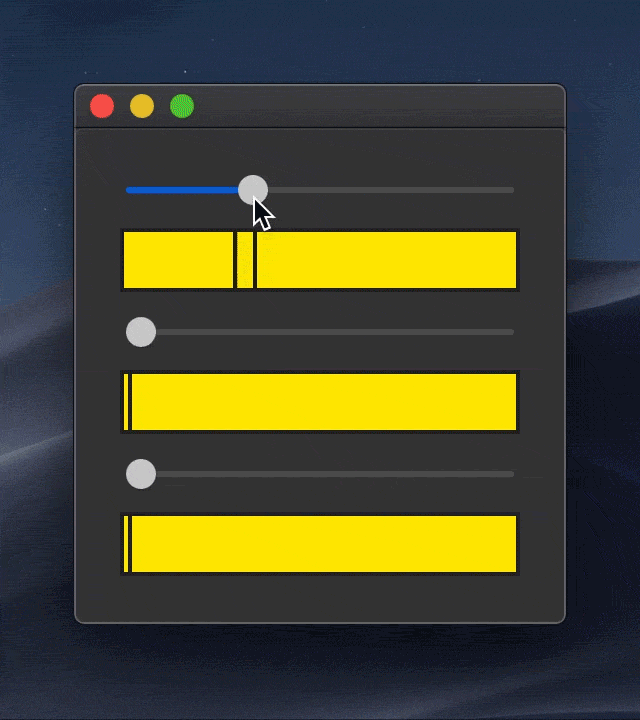

# VisOpt Slider

[](https://travis-ci.com/yuki-koyama/visoptslider)


Qt-based implementation of VisOpt Slider widget [UIST 2014] for C++ & Python



This repository provides

1. a fully C++ implementation based on Qt5 and
2. a fully Python implementation based on PySide2 (Qt5).

If your applications are based on Qt, it is quite easy to integrate a VisOpt Slider widget into your applications.

## Features

VisOpt Slider is a GUI widget consisting of multiple sliders. It is specifically designed for interactive exploration of a high-dimensional scalar-valued function. It has the following special features.

### Visualization

VisOpt Slider visualizes the values of the target function along with the sliders in the interface using a colormap.

### Optimization

_Not available yet_. Please refer to the original paper [(Koyama et al. 2014)](https://koyama.xyz/project/CrowdPoweredAnalysis/) and its extended version [(Koyama et al. 2016)](https://koyama.xyz/project/SelPh/).

## For Python Users

### Install

This package can be install via `pip`:
```
pip install visoptslider
```
By this, the dependencies (`matplotlib`, `numpy`, `PySide2`, and their dependencies) will be automatically installed together.

### Python Example

```python
from PySide2.QtWidgets import QApplication
import numpy as np
import visoptslider

if __name__ == "__main__":
    app = QApplication()

    # Define a target function
    num_dimensions = 3
    def target_function(x):
        return 1.0 - np.linarg.norm(x)

    # Define a target bound
    upper_bound = np.array([+1.0, +1.0, +1.0])
    lower_bound = np.array([-1.0, -1.0, -1.0])
    maximum_value = 1.0
    minimum_value = 0.0

    # Instantiate and initialize VisOpt Slider
    sliders_widget = visoptslider.SlidersWidget()
    sliders_widget.initialize(num_dimensions=num_dimensions,
                              target_function=target_function,
                              upper_bound=upper_bound,
                              lower_bound=lower_bound,
                              maximum_value=maximum_value,
                              minimum_value=minimum_value)

    # Show VisOpt Sliders
    sliders_widget.show()

    app.exec_()
```

## For C++ Users

### Build

This project is managed by using CMake. It can be built by the standard CMake cycle:
```
git clone https://github.com/yuki-koyama/visoptslider.git --recursive
mkdir build
cd build
cmake ../visoptslider
make
```

### C++ Example

```cpp
#include <QApplication>
#include <visoptslider/visoptslider.hpp>

int main(int argc, char *argv[])
{
    QApplication app(argc, argv);

    // Define a target function
    constexpr int num_dimensions = 3;
    constexpr auto target_function = [](const Eigen::VectorXd& x)
    {
        return 1.0 - x.norm();
    };

    // Define a target bound
    const Eigen::Vector3d upper_bound(+ 1.0, + 1.0, + 1.0);
    const Eigen::Vector3d lower_bound(- 1.0, - 1.0, - 1.0);
    constexpr double maximum_value = 1.0;
    constexpr double minimum_value = 0.0;

    // Instantiate and initialize VisOpt Slider
    visopt::SlidersWidget sliders_widget;
    sliders_widget.initialize(num_dimensions,
                              target_function,
                              upper_bound,
                              lower_bound,
                              maximum_value,
                              minimum_value);

    // Show VisOpt Slider
    sliders_widget.show();

    return app.exec();
}
```

### Dependencies

#### Prerequisites

- Eigen (e.g., `brew install eigen` / `apt install libeigen3-dev`)
- Qt5 (e.g., `brew install qt` / `apt install qt5-default`)

#### Included as Submodules

- tinycolormap <https://github.com/yuki-koyama/tinycolormap>
- optimization-test-functions <https://github.com/yuki-koyama/optimization-test-functions>

## References

- Yuki Koyama, Daisuke Sakamoto, and Takeo Igarashi. 2014. __Crowd-Powered Parameter Analysis for Visual Design Exploration__. In _Proceedings of the 27th annual ACM symposium on User interface software and technology_ (UIST '14), pp.65-74. DOI: <https://doi.org/10.1145/2642918.2647386>
  - Project page: <https://koyama.xyz/project/CrowdPoweredAnalysis/>
- Yuki Koyama, Daisuke Sakamoto, and Takeo Igarashi. 2016. __SelPh: Progressive Learning and Support of Manual Photo Color Enhancement__. In _Proceedings of the 2016 CHI Conference on Human Factors in Computing Systems_ (CHI '16), pp.2520--2532. DOI: <https://doi.org/10.1145/2858036.2858111>
  - Project page: <https://koyama.xyz/project/SelPh/>

## License

MIT License.

## Contributing

Issue reports, suggestions, requests, and PRs are highly welcomed.

Many features are currently missing; for example,
- Interactive optimization functionality [(Koyama et al. 2014)](https://koyama.xyz/project/CrowdPoweredAnalysis/)
- Option to make colors de-saturated [(Koyama et al. 2016)](https://koyama.xyz/project/SelPh/)
- Options for colormaps (currently, it always uses the `viridis` colormaps)
- Options for slider directions (currently, it always uses horizontal sliders)
- Tests for the Python package with various Python environments
- Support of Python 2.x
- Documentation
